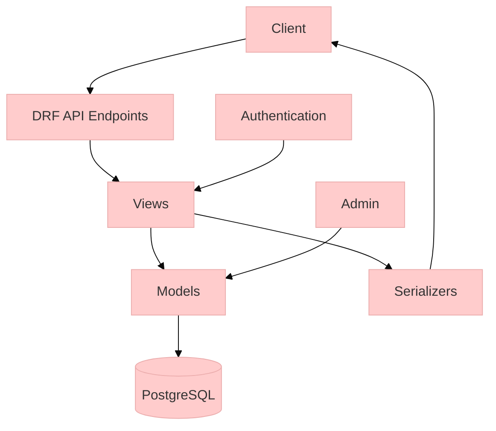

## setting up the virtual environnment

### 1- Créer l'environnement virtuel

               python -m venv venv

#### Concept:

### 2- Activer l'environnement (Linux/Mac)

                source venv/bin/activate

### 3- Activer l'environnement (Windows)

            venv\Scripts\activate

-------------

--------------

---------------

## Initialize the project

### 4- Installer Django

         pip install django djangorestframework django-cors-headers python-dotenv

### 5- Créer la structure de projet

         django-admin startproject config .
         python manage.py startapp core


-----------------------------------------------------------------------
---------------
--------------

## creating models in django

Let's break down your models **line by line** with extreme care. I'll explain every component in detail before discussing testing.

---

### **1. User Model**
```python
from django.db import models
from django.contrib.auth.models import AbstractUser

class User(AbstractUser):  # <-- Inheritance from Django's base user
    is_hotel_owner = models.BooleanField(default=False)  # <-- User type flag
    email = models.EmailField(unique=True)  # <-- Unique email constraint
    created_at = models.DateTimeField(auto_now_add=True)  # <-- Automatic timestamp

    class Meta:  # <-- Model metadata class
        ordering = ['-created_at']  # <-- Default sorting
```

**Detailed Explanation:**
1. **`AbstractUser` Inheritance**  
   - Gives you all default user fields: username, password, first_name, etc.  
   - Lets you add custom fields while keeping Django's auth system intact

2. **`is_hotel_owner`**  
   - Boolean (True/False) field  
   - Default: `False` (regular guest user)  
   - Used to differentiate user types in your business logic

3. **`email = models.EmailField(unique=True)`**  
   - Requires unique email addresses system-wide  
   - Will throw error if duplicate email is entered  
   - Better than username for authentication (matches modern standards)

4. **`auto_now_add=True`**  
   - Automatically sets field to current datetime when user is created  
   - Cannot be modified afterwards

5. **`Meta.ordering`**  
   - Affects default ordering when querying users  
   - `-created_at` = newest users first  
   - Impacts admin interface and API listings

---

### **2. HotelOwner Model**
```python
class HotelOwner(models.Model):
    user = models.OneToOneField(  # <-- 1:1 relationship
        User,  # <-- Linked to User model
        on_delete=models.CASCADE,  # <-- Delete profile if user is deleted
        primary_key=True  # <-- Uses user ID as primary key
    )
    business_name = models.CharField(max_length=255)  # <-- Company name
    contact_number = models.CharField(max_length=20)  # <-- Phone number
```

**Key Relationships:**
- **OneToOneField** creates a direct link between User and HotelOwner:
  ```
  User (1) ───── HotelOwner (1)
  ```

- **`primary_key=True`** means:
  - No separate ID field for HotelOwner
  - The `user_id` becomes the primary key

- **`on_delete=models.CASCADE`** ensures:
  - Deleting a User automatically deletes their HotelOwner profile
  - Prevents orphaned owner records

---

### **3. Hotel Model**
```python
class Hotel(models.Model):
    owner = models.ForeignKey(  # <-- Many:1 relationship
        HotelOwner,  # <-- Linked to HotelOwner
        on_delete=models.CASCADE  # <-- Delete hotels if owner is deleted
    )
    name = models.CharField(max_length=255)  # <-- Hotel name
    location = models.CharField(max_length=255)  # <-- Physical address
    description = models.TextField()  # <-- Long description
    rating = models.FloatField(default=0.0)  # <-- Average rating
    amenities = models.JSONField(default=list)  # <-- PostgreSQL JSONB storage
```

**Critical Fields for Search (Your Sprint Goal):**
- **`location`**: Will be used for location-based searches ("Paris", "New York")
- **`rating`**: Essential for filtering/sorting results
- **`amenities`**: Enables queries like "hotels with pool AND wifi"
- **`name`**: Primary search field

**PostgreSQL Advantage:**  
The `JSONField` leverages PostgreSQL's powerful JSONB format for efficient querying:
```python
# Example query: Find hotels with pool
Hotel.objects.filter(amenities__contains=['Pool'])
```

---

### **4. Room Model**
```python
class Room(models.Model):
    hotel = models.ForeignKey(  # <-- Many:1 relationship
        Hotel,
        on_delete=models.CASCADE  # <-- Delete rooms if hotel is deleted
    )
    room_number = models.CharField(max_length=10)  # <-- "101A", "Penthouse"
    room_type = models.CharField(max_length=50)  # <-- "Standard", "Suite"
    price_per_night = models.DecimalField(  # <-- Precise decimal storage
        max_digits=10,  # <-- Up to 99999999.99
        decimal_places=2
    )
    capacity = models.IntegerField()  # <-- Max guests
    is_available = models.BooleanField(default=True)  # <-- Booking status
```

**Why DecimalField for Price?**  
- Avoids floating-point rounding errors  
- Exact precision for currency: $100.50 vs 100.5 (float)  
- `max_digits=10` allows up to **$99,999,999.99**

---

### **Testing Readiness**

**Yes, you can test this now!** Here's how:

1. **First Migration**  
```bash
python manage.py makemigrations
python manage.py migrate
```

2. **Basic Tests to Implement**  
Create `tests.py` in your `core` app:

```python
from django.test import TestCase
from .models import User, HotelOwner, Hotel, Room

class ModelTests(TestCase):
    def test_user_creation(self):
        user = User.objects.create_user(
            username='testuser',
            email='test@example.com',
            password='testpass123'
        )
        self.assertEqual(user.email, 'test@example.com')
        self.assertFalse(user.is_hotel_owner)

    def test_hotel_owner_creation(self):
        user = User.objects.create_user(
            username='owner',
            email='owner@hotel.com',
            password='testpass123',
            is_hotel_owner=True
        )
        owner = HotelOwner.objects.create(
            user=user,
            business_name="Grand Hotels",
            contact_number="+123456789"
        )
        self.assertEqual(owner.business_name, "Grand Hotels")
        self.assertEqual(owner.user.email, 'owner@hotel.com')

    def test_hotel_creation(self):
        owner_user = User.objects.create_user(
            username='hotelowner',
            email='owner@example.com',
            password='testpass123',
            is_hotel_owner=True
        )
        owner = HotelOwner.objects.create(
            user=owner_user,
            business_name="Beach Resorts",
            contact_number="+15551234"
        )
        hotel = Hotel.objects.create(
            owner=owner,
            name="Paradise Beach Resort",
            location="Maldives",
            description="Luxury beachfront villas",
            rating=4.8,
            amenities=["Pool", "Spa", "WiFi"]
        )
        self.assertEqual(hotel.amenities, ["Pool", "Spa", "WiFi"])
        self.assertEqual(hotel.owner.business_name, "Beach Resorts")
```

**To Run Tests:**
```bash
python manage.py test core
```

---

### **Recommended Test Coverage**

1. **Field Validation Tests**
```python
def test_email_uniqueness(self):
    User.objects.create_user(username='u1', email='dupe@test.com', password='pass')
    with self.assertRaises(Exception):  # Should raise IntegrityError
        User.objects.create_user(username='u2', email='dupe@test.com', password='pass')

def test_rating_range(self):
    hotel = Hotel(rating=5.5)  # Invalid rating >5
    with self.assertRaises(ValidationError):
        hotel.full_clean()
```

2. **Relationship Tests**
```python
def test_owner_hotel_relationship(self):
    owner = HotelOwner.objects.create(...)
    hotel = Hotel.objects.create(owner=owner, ...)
    self.assertEqual(hotel.owner.user.email, owner.user.email)
```

3. **Business Logic Tests**
```python
def test_room_availability(self):
    room = Room.objects.create(...)
    self.assertTrue(room.is_available)
    room.is_available = False
    room.save()
    self.assertFalse(Room.objects.get(pk=room.pk).is_available)
```

---

### **Next Steps When Ready**
1. Create the test file and implement basic tests
2. Run migrations to create database tables
3. Experiment in Django shell:
```bash
python manage.py shell
>>> from core.models import *
>>> HotelOwner.objects.all()
```


----------------------------------------------------------------------------
-----------------------
-----------------------

sample django project

```mermaid
project-root/
├── config/
│   ├── settings.py
│   ├── urls.py
│   └── wsgi.py
├── core/
│   ├── models.py
│   ├── views.py
│   ├── serializers.py
│   ├── admin.py
│   ├── tests.py
│   └── urls.py
├── manage.py
└── requirements.txt
```

---
component diagram

